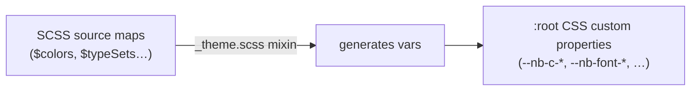

<doc-tab name="Overview">

NubiscoUI ships with a complete SCSS token system. Every visual decision, color, spacing, type scale, z-index, field heights, is a CSS custom property derived from typed SCSS maps. You do not need to write SCSS to use it.

## How it works

The pipeline has three stages:



1. **SCSS maps** (`src/styles/variables/`) define every raw value, color names, type scales, spacing ratios, z-index stacks.
2. **`_theme.scss`** iterates those maps and emits a CSS custom property for each entry onto `:root`.
3. **Your browser** resolves the properties at runtime. No rebuild needed to change a value.

## Overriding tokens as a consumer

You don't need to touch SCSS. Override CSS custom properties in your own stylesheet:

```css
/* main.css or App.vue <style> */
:root {
  /* Rebrand primary color */
  --nb-c-primary: #1a56db;
  --nb-c-primary-hover: #1e429f;
  --nb-c-primary-active: #1c3fa0;

  /* Change the base spacing unit (all gaps, field heights scale with it) */
  --nb-base-unit: 10px; /* default is 8px */
}
```

That is all. Every component that references `--nb-c-primary` or `--nb-base-unit` inherits the change automatically.

## Semantic vs. palette tokens

NubiscoUI separates two layers:

**Palette tokens**: raw color values tied to a named color. Rarely override these directly.

```css
--nb-c-grape-hyacinth-500: #5c35c4 /* auto-generated tint */
  --nb-c-grape-hyacinth-600: #4d2aa8 /* darker tint */;
```

**Semantic tokens**: intent-level tokens that components consume. Override these to rebrand.

```css
--nb-c-primary: var(--nb-c-grape-hyacinth-500) /* references palette */
  --nb-c-primary-hover: var(--nb-c-grape-hyacinth-600);
```

Override semantic tokens when you want to change the brand. Override palette tokens when you want to add new colors to the system.

## Customising in SCSS

If you import `@nubisco/ui/styles` directly, you can also override the SCSS maps before the library is compiled:

```scss
// Override the $colors map to inject your brand palette
@use '@nubisco/ui/variables' with (
  $colors: (
    grape-hyacinth: #5c35c4,
    // keep the base
    your-brand: #1a56db,
    // add yours
  )
);
```

This gives you the full shade ramp (`--nb-c-your-brand-100` through `--nb-c-your-brand-900`) plus a11y contrast variants: generated automatically from a single hex value.

</doc-tab>

<doc-tab name="Layers">

## Layer system

NubiscoUI uses a four-level layering system to create visual depth. Each layer defines a surface color, border color, and hover color. Components placed inside a layer context automatically inherit the correct tones.

### The problem

Without layers, a panel on a dark page background and a panel inside another panel both get the same `--nb-c-surface`. There is no visual distinction between nesting levels, and in dark mode the contrast between the app background and card surfaces may be too harsh or too subtle.

### How layers work

Four depth levels, from deepest to highest:

| Level | Class         | Light mode | Dark mode        | Typical use                       |
| ----- | ------------- | ---------- | ---------------- | --------------------------------- |
| 0     | `.nb-layer-0` | Light gray | Near-black       | App/page background               |
| 1     | `.nb-layer-1` | White      | Dark gray        | Panels, cards, sidebar body       |
| 2     | `.nb-layer-2` | Light gray | Medium-dark gray | Nested panels, inspector sections |
| 3     | `.nb-layer-3` | White      | Lighter gray     | Overlays, popovers, modals        |

In **light mode**, layers alternate between white and light gray, creating a subtle card-on-background effect.

In **dark mode**, layers get progressively lighter as elevation increases, providing clear visual separation.

### Usage

Apply a layer class to a container. All child components (`NbPanel`, `NbShell`, form inputs, etc.) automatically inherit the right surface colors:

```html
<!-- App background at layer 0 -->
<div class="nb-layer-0">
  <!-- Panel inherits layer-0 surface context -->
  <!-- But Panel itself renders with --nb-c-surface (layer-1 by default) -->
  <NbPanel>
    <!-- Nested content at layer 2 -->
    <div class="nb-layer-2">
      <NbPanel>
        <!-- This inner panel uses layer-2 surface -->
      </NbPanel>
    </div>
  </NbPanel>
</div>
```

### Dark mode

Activate dark mode by adding the `dark` class to your app root:

```html
<div id="app" class="dark">
  <!-- All components flip to dark surfaces automatically -->
</div>
```

Combine with layers:

```html
<div id="app" class="dark nb-layer-0">
  <!-- Dark page background with layered components -->
</div>
```

### Tokens

Each layer defines three CSS custom properties:

| Token                     | Description                    |
| ------------------------- | ------------------------------ |
| `--nb-c-layer-{N}`        | Surface background for layer N |
| `--nb-c-layer-border-{N}` | Border color for layer N       |
| `--nb-c-layer-hover-{N}`  | Hover background for layer N   |

The `.nb-layer-{N}` class maps these to the semantic tokens that components consume:

```css
.nb-layer-2 {
  --nb-c-surface: var(--nb-c-layer-2);
  --nb-c-border: var(--nb-c-layer-border-2);
  --nb-c-surface-hover: var(--nb-c-layer-hover-2);
}
```

### Overriding layer colors

Override layer tokens in your own stylesheet to match your brand:

```css
:root {
  --nb-c-layer-0: #0d1117;
  --nb-c-layer-1: #161b22;
  --nb-c-layer-2: #21262d;
  --nb-c-layer-3: #30363d;
}
```

</doc-tab>

<doc-tab name="Colors">

## Color system

Colors are defined in `src/styles/variables/_colors.scss` as a `$colors` map. Each entry is a name–hex pair. The system generates 17 tints per color (100–900) plus an accessible contrast variant (`-a11y`) for each tint.

### Adding a color

```scss
// src/styles/variables/_colors.scss
$colors: (
  grape-hyacinth: #5c35c4,
  plain-white: #ffffff,
  plain-black: #000000,
  // Add your brand color:
  ocean-drive: #0ea5e9,
);
```

This automatically generates:

```css
--nb-c-ocean-drive-100: /* lightest tint */ --nb-c-ocean-drive-200...
  --nb-c-ocean-drive-500: #0ea5e9 /* original */...
  --nb-c-ocean-drive-900: /* darkest tint */
  /* + a11y variants: auto-computed contrast color (black or white) */
  --nb-c-ocean-drive-500-a11y: #ffffff;
```

### Naming colors

Use the color naming tool below to generate a descriptive name for any hex value. Color names in NubiscoUI follow a "what it looks like" convention. Not "what it is used for" (that's what semantic tokens are for).

<color-steps-generator />

### Built-in palette

The default palette includes:

| Name                 | Value     | Use                        |
| -------------------- | --------- | -------------------------- |
| `grape-hyacinth`     | `#5c35c4` | Primary brand color        |
| `emerald-reflection` | `#4acf7b` | Success states             |
| `the-blues-brothers` | `#214da6` | Info states                |
| `phoenix-flames`     | `#f59e0b` | Warning states             |
| `chicken-comb`       | `#dc2626` | Danger/error states        |
| `nouveau-gray`       | `#6b7280` | Neutral UI chrome          |
| `french-gray`        | `#a7a7a7` | Borders, field backgrounds |
| `plain-white`        | `#ffffff` | Surfaces, backgrounds      |
| `plain-black`        | `#000000` | Text, contrast surfaces    |

### Wiring a color to a semantic role

After adding a palette color, point a semantic token at it:

```css
:root {
  --nb-c-primary: var(--nb-c-ocean-drive-500);
  --nb-c-primary-hover: var(--nb-c-ocean-drive-600);
  --nb-c-primary-active: var(--nb-c-ocean-drive-700);
  --nb-c-primary-a11y: var(--nb-c-ocean-drive-500-a11y);
}
```

</doc-tab>

<doc-tab name="Typography">

## Typography system

NubiscoUI ships with two typefaces via the `fonts` Vite plugin, and a SCSS-driven type scale that generates utility classes and CSS custom properties.

### Typefaces

**Plus Jakarta Sans** (`--nb-font-family-sans`), the primary typeface for all UI text. Used for labels, body copy, headings, and display type.

**Fira Code** (`--nb-font-family-mono`), monospace, used exclusively for code, JSON viewers, inline code, and keyboard shortcuts. Ligatures enabled by default.

Both are bundled in the library and served via the fonts plugin. No CDN dependency.

### Type sets

Components always use named type sets, never raw font sizes. A type set bundles size, weight, line-height, letter-spacing, and font-family into a single named role.

Apply a type set in one utility class:

```html
<p class="type-body-md">Readable paragraph text</p>
<span class="type-label-md">Form label</span>
<h2 class="type-heading-03">Section title</h2>
<code class="type-code-md">const x = 1</code>
```

Or via CSS custom properties in your own component:

```scss
.my-title {
  font-size: var(--nb-type-heading-03-size);
  font-weight: var(--nb-type-heading-03-weight);
  line-height: var(--nb-type-heading-03-line-height);
  letter-spacing: var(--nb-type-heading-03-letter-spacing);
}
```

### Adding a type set

Edit `$typeSets` in `src/styles/variables/_type.scss`:

```scss
$typeSets: (
  // ...existing sets...
  caption: (
      size: 11,
      weight: regular,
      line-height: 1.4,
      letter-spacing: 0.01em,
    )
) !default;
```

This automatically generates `--nb-type-caption-*` CSS variables and a `.type-caption` utility class.

### Full type set reference

See the [Typography principles page](/principles/typography) for the complete type scale, all named sets, and usage guidelines.

</doc-tab>

<doc-tab name="Custom Properties">

## CSS custom property reference

All tokens are emitted on `:root`. Override any of these in your own stylesheet to customise the system.

### Base unit

| Token            | Default | Description                                                                                           |
| ---------------- | ------- | ----------------------------------------------------------------------------------------------------- |
| `--nb-base-unit` | `8px`   | The geometric base for all spacing. All gaps, field heights, and padding are multiples of this value. |

### Semantic color tokens

These are the tokens you override to rebrand the library. Each semantic token has a base, hover, and active state, plus an `-a11y` variant for text rendered on that color.

| Token                   | Default                | Description          |
| ----------------------- | ---------------------- | -------------------- |
| `--nb-c-primary`        | grape-hyacinth-500     | Primary brand color  |
| `--nb-c-primary-hover`  | grape-hyacinth-600     | Hover state          |
| `--nb-c-primary-active` | grape-hyacinth-700     | Active/pressed state |
| `--nb-c-secondary`      | plain-black-700        | Secondary actions    |
| `--nb-c-success`        | emerald-reflection-600 | Success / confirm    |
| `--nb-c-info`           | the-blues-brothers-500 | Informational        |
| `--nb-c-warning`        | phoenix-flames-500     | Warning / caution    |
| `--nb-c-danger`         | chicken-comb-500       | Error / destructive  |

Each token above also has `-a11y` (auto-computed contrast text color), `-hover`, `-hover-a11y`, `-active`, `-active-a11y` variants.

### Layers

| Token                       | Description                       |
| --------------------------- | --------------------------------- |
| `--nb-c-layer-0`            | App/page background surface       |
| `--nb-c-layer-1`            | Panels, cards surface             |
| `--nb-c-layer-2`            | Nested panels, inspector sections |
| `--nb-c-layer-3`            | Overlays, modals, popovers        |
| `--nb-c-layer-border-{0-3}` | Border color for each layer       |
| `--nb-c-layer-hover-{0-3}`  | Hover background for each layer   |

See the [Layers tab](#layers) for usage details.

### Surface & text

| Token                   | Description                                       |
| ----------------------- | ------------------------------------------------- |
| `--nb-c-surface`        | Current surface background (set by layer context) |
| `--nb-c-surface-raised` | Background below the current surface (page level) |
| `--nb-c-border`         | Current border color (set by layer context)       |
| `--nb-c-surface-hover`  | Hover background for current layer                |
| `--nb-c-contrast`       | Maximum contrast on surface (near-black in light) |
| `--nb-c-document`       | Page/document background                          |
| `--nb-c-white`          | Absolute white, not theme-aware                   |
| `--nb-c-black`          | Absolute black, not theme-aware                   |
| `--nb-c-text`           | Primary body text                                 |
| `--nb-c-text-muted`     | Supporting text, captions, secondary labels       |
| `--nb-c-text-subtle`    | Placeholder text, disabled labels                 |
| `--nb-c-bg`             | Page background tier                              |
| `--nb-c-bg-soft`        | Elevated/inset background tier                    |

### Form field tokens

| Token                         | Default                | Description                 |
| ----------------------------- | ---------------------- | --------------------------- |
| `--nb-c-field-bg`             | french-gray-100        | Input background            |
| `--nb-c-field-border`         | french-gray-500        | Input border                |
| `--nb-field-height-sm`        | `4 × base-unit` (32px) | Small field height          |
| `--nb-field-height-md`        | `5 × base-unit` (40px) | Medium field height         |
| `--nb-field-height-lg`        | `6 × base-unit` (48px) | Large field height          |
| `--nb-field-padding-h`        | `2 × base-unit` (16px) | Horizontal field padding    |
| `--nb-field-font-size`        | `--nb-font-size-14`    | Font size for all inputs    |
| `--nb-field-disabled-opacity` | `0.45`                 | Opacity for disabled fields |

### Grid

| Token                 | Default  | Description            |
| --------------------- | -------- | ---------------------- |
| `--nb-grid-max-width` | `1440px` | Maximum content width  |
| `--nb-grid-columns`   | `16`     | Number of grid columns |
| `--nb-grid-gutter`    | `16px`   | Grid gutter size       |

### Gap scale

| Token          | Value  | Description  |
| -------------- | ------ | ------------ |
| `--nb-gap-xxs` | `2px`  | ¼ base unit  |
| `--nb-gap-xs`  | `4px`  | ½ base unit  |
| `--nb-gap-sm`  | `8px`  | 1× base unit |
| `--nb-gap-md`  | `16px` | 2× base unit |
| `--nb-gap-lg`  | `24px` | 3× base unit |
| `--nb-gap-xl`  | `32px` | 4× base unit |
| `--nb-gap-xxl` | `48px` | 6× base unit |

### Z-index stack

| Token                     | Description          |
| ------------------------- | -------------------- |
| `--nb-zindex-root`        | Base layer (0)       |
| `--nb-zindex-tableheader` | Sticky table headers |
| `--nb-zindex-select`      | Select dropdowns     |
| `--nb-zindex-dropdown`    | Dropdown menus       |
| `--nb-zindex-pageheader`  | Sticky page headers  |
| `--nb-zindex-titlebar`    | App title bar        |
| `--nb-zindex-navigation`  | Top navigation       |
| `--nb-zindex-backdrop`    | Modal backdrop       |
| `--nb-zindex-modal`       | Modal dialogs        |
| `--nb-zindex-toast`       | Toast notifications  |
| `--nb-zindex-tooltip`     | Tooltips (highest)   |

See [Z-Index principles](/principles/z-index) for the full rationale and values.

</doc-tab>
