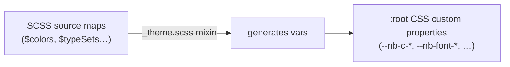

<doc-tab name="Overview">

NubiscoUI ships with a complete SCSS token system. Every visual decision, color, spacing, type scale, z-index, field heights, is a CSS custom property derived from typed SCSS maps. You do not need to write SCSS to use it.

## How it works

The pipeline has three stages:


```mermaid
graph LR
    A["SCSS source maps<br/>($colors, $typeSets…)"] -->|_theme.scss mixin| B["generates vars"]
    B --> C[":root CSS custom properties<br/>(--nb-c-*, --nb-font-*, …)"]
```

1. **SCSS maps** (`src/styles/variables/`) define every raw value, color names, type scales, spacing ratios, z-index stacks.
2. **`_theme.scss`** iterates those maps and emits a CSS custom property for each entry onto `:root`.
3. **Your browser** resolves the properties at runtime. No rebuild needed to change a value.

## Overriding tokens as a consumer

You don't need to touch SCSS. Override CSS custom properties in your own stylesheet:

```css
/* main.css or App.vue <style> */
:root {
  /* Rebrand primary color */
  --nb-c-primary: #1a56db;
  --nb-c-primary-hover: #1e429f;
  --nb-c-primary-active: #1c3fa0;

  /* Change the base spacing unit (all gaps, field heights scale with it) */
  --nb-base-unit: 10px; /* default is 8px */
}
```

That is all. Every component that references `--nb-c-primary` or `--nb-base-unit` inherits the change automatically.

## Semantic vs. palette tokens

NubiscoUI separates two layers:

**Palette tokens**: raw color values tied to a named color. Rarely override these directly.

```css
--nb-c-grape-hyacinth-500: #5c35c4 /* auto-generated tint */
  --nb-c-grape-hyacinth-600: #4d2aa8 /* darker tint */;
```

**Semantic tokens**: intent-level tokens that components consume. Override these to rebrand.

```css
--nb-c-primary: var(--nb-c-grape-hyacinth-500) /* references palette */
  --nb-c-primary-hover: var(--nb-c-grape-hyacinth-600);
```

Override semantic tokens when you want to change the brand. Override palette tokens when you want to add new colors to the system.

## Customising in SCSS

If you import `@nubisco/ui/styles` directly, you can also override the SCSS maps before the library is compiled:

```scss
// Override the $colors map to inject your brand palette
@use '@nubisco/ui/variables' with (
  $colors: (
    grape-hyacinth: #5c35c4,
    // keep the base
    your-brand: #1a56db,
    // add yours
  )
);
```

This gives you the full shade ramp (`--nb-c-your-brand-100` through `--nb-c-your-brand-900`) plus a11y contrast variants: generated automatically from a single hex value.

</doc-tab>

<doc-tab name="Layers">

<script setup>
const layerProps = [
  {
    name: 'theme',
    type: 'single',
    label: 'Theme',
    default: 'light',
    options: [
      { value: 'light', label: 'Light' },
      { value: 'dark', label: 'Dark' },
    ],
  },
]
</script>

## Layers

Four visual depth levels, `0` to `3`, that keep stacked surfaces distinct in both
themes. **Depth is derived from nesting, not declared.** A component that paints a
surface takes the current layer and moves everything inside it one level deeper,
clamped at 3 so deep trees repeat the top layer instead of running out.

### Nesting decides depth

Nothing in this example names a layer. Each panel works out its own depth from
where it sits.

<preview :props="layerProps" v-slot="{ resultingProps }">
  <div :class="resultingProps.theme === 'dark' ? 'dark' : ''" style="padding: 20px; background: var(--nb-c-layer-0);">
    <NbLabel size="sm" muted>Page ground, layer 0</NbLabel>
    <NbPanel style="margin-top: 8px;">
      <NbLabel size="sm" muted>Panel, layer 1</NbLabel>
      <NbPanel style="margin-top: 8px;">
        <NbLabel size="sm" muted>Panel in a panel, layer 2</NbLabel>
        <NbPanel style="margin-top: 8px;">
          <NbLabel size="sm" muted>Panel in a panel in a panel, layer 3</NbLabel>
          <NbPanel style="margin-top: 8px;">
            <NbLabel size="sm" muted>Deeper still: clamped, stays at layer 3</NbLabel>
          </NbPanel>
        </NbPanel>
      </NbPanel>
    </NbPanel>
  </div>
</preview>

```vue
<NbPanel>
  <NbPanel>
    <NbPanel>
      <NbPanel />
    </NbPanel>
  </NbPanel>
</NbPanel>
```

Nesting is counted through ordinary markup, so wrappers, grids and slots in
between do not break the chain.

### Where a layer comes from

A surface resolves its level in this order, strongest first.

| #   | Source                                 | Example                                            |
| --- | -------------------------------------- | -------------------------------------------------- |
| 1   | An explicit `level` prop               | `<NbPanel :layer="0" />`                           |
| 2   | An explicit class on the component     | `<NbPanel class="nb-layer-3" />`                   |
| 3   | The nearest layer authority in the DOM | a hand-written `<div class="nb-layer-2">` above it |
| 4   | The enclosing surface's context        | a panel inside a panel                             |
| 5   | Level 1                                | the `:root` default of `--nb-c-surface`            |

Rules 3 and 4 always agree in a tree built only from library components. Rule 3
exists so that a `.nb-layer-N` container written by an application still wins,
which the component tree cannot see on its own.

Overlays that leave the document flow (Modal, the DatePicker calendar, and the
teleported popovers) pin to layer 3 instead of inheriting the depth of whatever
their teleport target happens to sit in.

### Which components participate

These take a layer from context and deepen what they contain.

| Component        | Surface it owns                                                                                                                                                    |
| ---------------- | ------------------------------------------------------------------------------------------------------------------------------------------------------------------ |
| `NbPanel`        | its own background                                                                                                                                                 |
| `NbShellPanel`   | its own background                                                                                                                                                 |
| `NbDataTable`    | the table body behind toolbar, header and rows                                                                                                                     |
| `NbCalendar`     | the calendar frame                                                                                                                                                 |
| `NbBoard`        | its column headers and cards                                                                                                                                       |
| `NbFileUploader` | the file rows it lists                                                                                                                                             |
| `NbShell`        | the application frame: resolves to layer 1 at the top of a tree, exactly what its chrome already painted, and acts as the origin of depth for everything inside it |
| `NbModal`        | pinned to layer 3, teleported                                                                                                                                      |
| `NbDatePicker`   | its calendar dialog, pinned to layer 3, teleported                                                                                                                 |

These deliberately do not, and inherit the surface of whatever they sit in.

| Component                                  | Why not                                                                                                                                                                                                      |
| ------------------------------------------ | ------------------------------------------------------------------------------------------------------------------------------------------------------------------------------------------------------------ |
| `NbMenuBar`, `NbPagination`                | chrome strips, not containers. Their background exists to match the surface they are attached to (a pagination bar is the footer of its table), and they hold controls rather than a new ground for content. |
| `NbJsonTree`, `NbImageCropper`             | they use the surface token for an inline editing highlight, a drag handle and a thumbnail frame. That is a fill, not a depth.                                                                                |
| `NbMenu`, `NbCommandPalette`, `NbUserMenu` | already floating at the top of the stack: they read `--nb-c-layer-3` directly, so no context can pull them off it.                                                                                           |
| `NbSelect`, `NbSubmenu`, sidebar flyouts   | painted from field and shell tokens, not from the layer ramp.                                                                                                                                                |

### Taking explicit control

`.nb-layer-{0-3}` still pins a subtree to an absolute layer and restarts the
contextual count from there. The nearest container wins.

<preview :props="layerProps" v-slot="{ resultingProps }">
  <div :class="[resultingProps.theme === 'dark' ? 'dark' : '', 'nb-layer-0']" style="padding: 20px; background: var(--nb-c-surface);">
    <NbLabel size="sm" muted>Container pinned to layer 0</NbLabel>
    <NbPanel style="margin-top: 8px;">
      <NbLabel size="sm" muted>Panel, layer 1</NbLabel>
      <NbGrid dir="col" gap="sm" style="margin-top: 8px;">
        <NbTextInput label="Name" placeholder="Enter your name" size="sm" />
        <div class="nb-layer-2" style="padding: 12px;">
          <NbLabel size="sm" muted>Container pinned to layer 2</NbLabel>
          <NbPanel style="margin-top: 8px;">
            <NbLabel size="sm" muted>Panel, layer 3</NbLabel>
            <NbButton variant="primary" size="sm" style="margin-top: 8px;">Action</NbButton>
          </NbPanel>
        </div>
      </NbGrid>
    </NbPanel>
  </div>
</preview>

```vue
<!-- derived: 1, then 2 -->
<NbPanel>
  <NbPanel />
</NbPanel>

<!-- pinned on the component -->
<NbPanel :layer="0" />
<NbPanel class="nb-layer-3" />

<!-- pinned on a container: everything inside starts counting from 2 -->
<NbLayer :level="2">
  <NbPanel />
  <!-- layer 2 -->
</NbLayer>

<!-- one step deeper without naming a number -->
<NbLayer>
  <NbPanel />
</NbLayer>
```

#### When to name a layer, and when not to

Name one when:

- you are painting your own surface in application CSS and the runtime cannot
  help you: `.nb-layer-2` on the wrapper gives your `var(--nb-c-surface)` rule
  the right value;
- you are **resetting**, not counting. A region that should read as a fresh
  ground regardless of how deep it happens to be mounted (a document canvas, a
  preview pane, an embedded editor) is exactly what `.nb-layer-0` is for;
- a surface is created by markup the library never sees, for example content
  rendered by a third-party widget.

Do not name one when you are only counting depth you could have derived. A
`.nb-layer-2` written because "this panel is two deep" is a fact the component
already knows, and it becomes wrong the first time someone moves the markup. If
you find yourself computing a number, delete it and let nesting do the work.

Prefer `<NbLayer :level="N">` over the raw class inside Vue: it sets the class
**and** the context, so components inside it agree with plain CSS inside it. The
raw class is the right tool in a stylesheet or in markup that no Vue component
owns.

### The ramp

Values are defined outright in `src/styles/variables/_layers.scss`, not derived
from a tint chain, because every one of them is chosen to clear a measured
threshold. Both ramps are a single neutral hue family and every emitted value is
integer-channel hex.

**Light** surfaces descend from a near-white page. CIE L\* 97.21 / 93.37 / 89.51
/ 85.60, adjacent steps 3.83 / 3.87 / 3.90.

| Level | Surface   | Border    | Hover     |
| ----- | --------- | --------- | --------- |
| 0     | `#f6f7f9` | `#aeafb1` | `#edeef0` |
| 1     | `#ebecee` | `#9e9fa1` | `#e2e3e5` |
| 2     | `#e0e1e3` | `#8f9092` | `#d7d8da` |
| 3     | `#d5d6d8` | `#818284` | `#cbccce` |

Text `#202123`, muted text `#343537`, field background `#cdced0`, field border `#6c6d6f`.

**Dark** surfaces rise from a near-black page. CIE L\* 4.63 / 11.69 / 18.87 /
26.15, adjacent steps 7.06 / 7.18 / 7.27.

| Level | Surface   | Border    | Hover     |
| ----- | --------- | --------- | --------- |
| 0     | `#0f1011` | `#434445` | `#1a1b1c` |
| 1     | `#1e1f20` | `#4d4e4f` | `#292a2b` |
| 2     | `#2d2e2f` | `#595a5b` | `#38393a` |
| 3     | `#3d3e3f` | `#696a6b` | `#313233` |

Text `#eaebec`, muted text `#d0d1d2`, field background `#141516`, field border `#626364`.

Adjacent separation never decreases with depth in either theme, so nesting reads
as a position in an order rather than as a set of local boundaries.

Dark hover reverses direction at layer 3: levels 0 to 2 lighten by about 5.1
dL\*, level 3 darkens by 5.42. There is no headroom above layer 3, and a hover
surface lighter than it would push muted text toward white and collapse the gap
between the two text tiers.

### Measured contrast

Every ratio below is WCAG 2.x, measured on the compiled stylesheet by
`node scripts/audit-contrast.mjs` and enforced on every commit by
`tests/layerContrast.test.ts`. The bar is AAA (7:1) for `--nb-c-text` and
`--nb-c-text-muted` on every surface text can land on, resting **and** hovered,
plus the field background. `--nb-c-text-subtle` is held to AA on the same nine
surfaces, for the reason given under Custom Properties below.

Tokens outside the layer ramp (selected, active and accent fills, and the status
colours) are not covered by these figures or by the guard.

**Light**

| Surface  | Primary text | Muted text |
| -------- | ------------ | ---------- |
| layer-0  | 15.03        | 11.45      |
| layer-1  | 13.63        | 10.39      |
| layer-2  | 12.31        | 9.38       |
| layer-3  | 11.08        | 8.44       |
| hover-0  | 13.88        | 10.58      |
| hover-1  | 12.55        | 9.56       |
| hover-2  | 11.30        | 8.61       |
| hover-3  | 10.03        | 7.64       |
| field-bg | 10.23        | 7.80       |

**Dark**

| Surface  | Primary text | Muted text |
| -------- | ------------ | ---------- |
| layer-0  | 15.96        | 12.46      |
| layer-1  | 13.83        | 10.80      |
| layer-2  | 11.40        | 8.90       |
| layer-3  | 8.98         | 7.01       |
| hover-0  | 14.45        | 11.28      |
| hover-1  | 12.05        | 9.40       |
| hover-2  | 9.70         | 7.57       |
| hover-3  | 10.76        | 8.40       |
| field-bg | 15.32        | 11.96      |

Borders read 2.05 to 2.64 against their own surface in light and 1.95 to 1.98 in
dark; the field border, the one strong-edge role, reads 3.29 (light) and 3.04
(dark) against the field it encloses.

### Breaking change

Both ramps changed. If you set `--nb-c-layer-*` yourself, or built screens
against the old values, re-check them.

- **The light ramp direction inverted.** The page ground is now the lightest
  surface and panels get progressively darker as they nest. Previously the page
  was grey (`#e5e5e5`) and panels were white, alternating, so layer 2 was
  byte-identical to layer 0 and nesting past one level had no fill cue at all.
- **Every dark value moved.** The old dark ramp mixed two hue families (layer 1
  came from a pure neutral, its neighbours from a blue-ish grey) and separated
  by 6.70 / 5.20 / 5.58 dL\*, weakest in the middle. It is now one neutral
  family, separating 7.06 / 7.18 / 7.27.
- **Muted text was failing.** 4.82:1 on light layers 0 and 2, and 3.62:1 on dark
  layer 3, which is below AA. The floor is now 7.01:1 across all nine painted
  surfaces in both themes.
- **`--nb-c-text-subtle` was failing AA everywhere.** It measured 3.32:1 on
  light layer 3 and 2.22:1 on dark layer 3 against the old values, and was
  never measured. It now clears AA on all nine surfaces in both themes.
- **Surfaces were fractional.** The old tint chain emitted
  `rgb(229.5, 229.5, 229.5)`. Every token is now integer-channel hex.
- **`--nb-c-field-bg` was the same value as layer 0**, so a field on the page
  had no fill boundary. It is now a distinct value in both themes.
- **`NbModal` now paints layer 3** rather than layer 1, and a surface nested in
  another surface now deepens instead of matching it. That is the defect being
  fixed, and it is the one difference visible in markup that never used
  `.nb-layer-N`.

Markup that annotated every nesting site by hand renders exactly as it did
before; that case is covered by tests.

## API

### `useSurfaceLayer()`

For component authors. Resolves the level and returns the attributes to bind on
the element that paints the surface.

```ts
import { useSurfaceLayer } from '@nubisco/ui'

const { level, layerClass, layerProps } = useSurfaceLayer()
```

```vue
<template>
  <div class="my-card" v-bind="layerProps">
    <slot />
  </div>
</template>
```

`layerProps` carries the `nb-layer-N` class and a `data-nb-layer` marker. The
marker is what tells a painted surface (children go one deeper) apart from a
bare context class (children paint exactly N).

| Option           | Meaning                                                                   |
| ---------------- | ------------------------------------------------------------------------- |
| `level`          | force an absolute level, ignoring context                                 |
| `overlay`        | the surface is teleported or floating: pin to layer 3, skip the DOM probe |
| `probe`          | run the mount-time DOM probe. Defaults on, off for overlays               |
| `el`             | the element that paints, when it is not the component root                |
| `provideContext` | publish context to descendants. Defaults on                               |

### `useLayer()`

Read-only. Reports the level the next surface below this point would paint,
which is what a component needs to decide, for example, which token to tint
against.

```ts
const { level } = useLayer()
```

### `<NbLayer>`

A context node, not a painted surface. With `level` it is exactly
`.nb-layer-N`. Without one it pushes its subtree one step deeper. `as` picks the
element it renders.

```vue
<NbLayer as="section" :level="0">
  <NbPanel />
  <!-- layer 0 -->
</NbLayer>
```

### Limitations

Stated plainly, because they are real.

- **The DOM probe is a mount-time snapshot.** A surface reads its surroundings
  once, on mount, and corrects itself on the next tick. Moving a mounted subtree
  into a container at a different depth does not re-derive its layer. Remount it,
  or pin it.
- **All overlays share the ceiling.** Every teleported surface pins to layer 3,
  so a popover opened from inside a modal cannot separate itself from the modal
  by fill alone. It separates by border and shadow instead.
- **Nesting past 3 repeats.** Depth 4 and beyond paint layer 3, matching
  Carbon's clamp. If your tree is that deep, the fill is no longer carrying the
  hierarchy and something else should.
- **CSS-only consumers get the utility classes, not the derivation.** Depth
  counting needs a runtime that can see the component tree. Without Vue,
  `.nb-layer-N` behaves exactly as it always has, and it is the whole mechanism
  available. This was measured rather than assumed: three CSS-only designs
  (a descendant chain, the same chain at zero specificity, and single-block token
  rotation) were prototyped and each failed on subtree resets or on teleported
  nodes. `@scope` handles both directions but its support floor is too high for
  this library to depend on.
- **The layer classes only carry three tokens.** `--nb-c-surface`,
  `--nb-c-border` and `--nb-c-surface-hover`. Anything else you paint stays where
  it was.

## Layer-aware tokens

`.nb-layer-{N}`, and every component that resolves a layer, reassign exactly
these three.

| Semantic token         | What it controls            |
| ---------------------- | --------------------------- |
| `--nb-c-surface`       | the layer's background fill |
| `--nb-c-border`        | the layer's border colour   |
| `--nb-c-surface-hover` | the layer's hover fill      |

Text tokens are set once per theme, not per layer. That is the point of the
ramp: `--nb-c-text` and `--nb-c-text-muted` clear AAA on all four layers, all
four hover states and the field, so text does not have to change when depth
does.

`--nb-c-text-subtle` is the exception and is held to **AA (4.5:1)**, not AAA, on
those same nine surfaces. That is arithmetic, not laziness: muted text already
sits at 8.44:1 on the deepest light surface, so a third tier lighter than muted
and still above 7:1 has almost no room to exist and would stop reading as a
separate tier. Carbon makes the same call with its own helper text. Use
`--nb-c-text-subtle` only for genuinely non-essential text, never for anything
someone has to read to operate the interface.

Components that tint with `color-mix()` against `var(--nb-c-surface)` (Badge,
for example) follow the current layer automatically.

## Tokens

| Token                     | Description                    |
| ------------------------- | ------------------------------ |
| `--nb-c-layer-{N}`        | surface background for layer N |
| `--nb-c-layer-border-{N}` | border colour for layer N      |
| `--nb-c-layer-hover-{N}`  | hover background for layer N   |

Override them to match your brand:

```css
:root {
  --nb-c-layer-0: #0d1117;
  --nb-c-layer-1: #161b22;
  --nb-c-layer-2: #21262d;
  --nb-c-layer-3: #30363d;
}
```

If you do, measure the result. `node scripts/audit-contrast.mjs` prints the same
report the library holds itself to, including the published Carbon Design System
values for comparison.

## Authoring layer-aware components

Paint with the semantic tokens, never with palette colours, and bind
`layerProps` on whichever element carries the background.

```vue
<template>
  <div class="my-card" v-bind="layerProps">
    <slot />
  </div>
</template>

<script setup lang="ts">
import { useSurfaceLayer } from '@nubisco/ui'

const { layerProps } = useSurfaceLayer()
</script>

<style lang="scss" scoped>
.my-card {
  background: var(--nb-c-surface);
  border: 1px solid var(--nb-c-border);
  color: var(--nb-c-text);

  &:hover {
    background: var(--nb-c-surface-hover);
  }
}
</style>
```

For tinted backgrounds, mix against `var(--nb-c-surface)` so the tint follows the
layer:

```scss
.my-status {
  background: color-mix(in srgb, var(--nb-c-info) 12%, var(--nb-c-surface));
  color: var(--nb-c-info);
}
```

</doc-tab>

<doc-tab name="Colors">

## Color system

Colors are defined in `src/styles/variables/_colors.scss` as a `$colors` map. Each entry is a name–hex pair. The system generates 17 tints per color (100–900) plus an accessible contrast variant (`-a11y`) for each tint.

### Adding a color

```scss
// src/styles/variables/_colors.scss
$colors: (
  grape-hyacinth: #5c35c4,
  plain-white: #ffffff,
  plain-black: #000000,
  // Add your brand color:
  ocean-drive: #0ea5e9,
);
```

This automatically generates:

```css
--nb-c-ocean-drive-100: /* lightest tint */ --nb-c-ocean-drive-200...
  --nb-c-ocean-drive-500: #0ea5e9 /* original */...
  --nb-c-ocean-drive-900: /* darkest tint */
  /* + a11y variants: auto-computed contrast color (black or white) */
  --nb-c-ocean-drive-500-a11y: #ffffff;
```

### Naming colors

Use the color naming tool below to generate a descriptive name for any hex value. Color names in NubiscoUI follow a "what it looks like" convention. Not "what it is used for" (that's what semantic tokens are for).

<color-steps-generator />

### Built-in palette

The default palette includes:

| Name                 | Value     | Use                        |
| -------------------- | --------- | -------------------------- |
| `grape-hyacinth`     | `#5c35c4` | Primary brand color        |
| `emerald-reflection` | `#4acf7b` | Success states             |
| `the-blues-brothers` | `#214da6` | Info states                |
| `phoenix-flames`     | `#f59e0b` | Warning states             |
| `chicken-comb`       | `#dc2626` | Danger/error states        |
| `nouveau-gray`       | `#6b7280` | Neutral UI chrome          |
| `french-gray`        | `#a7a7a7` | Borders, field backgrounds |
| `plain-white`        | `#ffffff` | Surfaces, backgrounds      |
| `plain-black`        | `#000000` | Text, contrast surfaces    |

### Wiring a color to a semantic role

After adding a palette color, point a semantic token at it:

```css
:root {
  --nb-c-primary: var(--nb-c-ocean-drive-500);
  --nb-c-primary-hover: var(--nb-c-ocean-drive-600);
  --nb-c-primary-active: var(--nb-c-ocean-drive-700);
  --nb-c-primary-a11y: var(--nb-c-ocean-drive-500-a11y);
}
```

</doc-tab>

<doc-tab name="Typography">

## Typography system

NubiscoUI ships with two typefaces via the `fonts` Vite plugin, and a SCSS-driven type scale that generates utility classes and CSS custom properties.

### Typefaces

**Plus Jakarta Sans** (`--nb-font-family-sans`), the primary typeface for all UI text. Used for labels, body copy, headings, and display type.

**Fira Code** (`--nb-font-family-mono`), monospace, used exclusively for code, JSON viewers, inline code, and keyboard shortcuts. Ligatures enabled by default.

Both are bundled in the library and served via the fonts plugin. No CDN dependency.

### Type sets

Components always use named type sets, never raw font sizes. A type set bundles size, weight, line-height, letter-spacing, and font-family into a single named role.

Apply a type set in one utility class:

```html
<p class="type-body-md">Readable paragraph text</p>
<span class="type-label-md">Form label</span>
<h2 class="type-heading-03">Section title</h2>
<code class="type-code-md">const x = 1</code>
```

Or via CSS custom properties in your own component:

```scss
.my-title {
  font-size: var(--nb-type-heading-03-size);
  font-weight: var(--nb-type-heading-03-weight);
  line-height: var(--nb-type-heading-03-line-height);
  letter-spacing: var(--nb-type-heading-03-letter-spacing);
}
```

### Adding a type set

Edit `$typeSets` in `src/styles/variables/_type.scss`:

```scss
$typeSets: (
  // ...existing sets...
  caption: (
      size: 11,
      weight: regular,
      line-height: 1.4,
      letter-spacing: 0.01em,
    )
) !default;
```

This automatically generates `--nb-type-caption-*` CSS variables and a `.type-caption` utility class.

### Full type set reference

See the [Typography principles page](/principles/typography) for the complete type scale, all named sets, and usage guidelines.

</doc-tab>

<doc-tab name="Custom Properties">

## CSS custom property reference

All tokens are emitted on `:root`. Override any of these in your own stylesheet to customise the system.

### Base unit

| Token            | Default | Description                                                                                           |
| ---------------- | ------- | ----------------------------------------------------------------------------------------------------- |
| `--nb-base-unit` | `8px`   | The geometric base for all spacing. All gaps, field heights, and padding are multiples of this value. |

### Semantic color tokens

These are the tokens you override to rebrand the library. Each semantic token has a base, hover, and active state, plus an `-a11y` variant for text rendered on that color.

| Token                   | Default                | Description          |
| ----------------------- | ---------------------- | -------------------- |
| `--nb-c-primary`        | grape-hyacinth-500     | Primary brand color  |
| `--nb-c-primary-hover`  | grape-hyacinth-600     | Hover state          |
| `--nb-c-primary-active` | grape-hyacinth-700     | Active/pressed state |
| `--nb-c-secondary`      | plain-black-700        | Secondary actions    |
| `--nb-c-success`        | emerald-reflection-600 | Success / confirm    |
| `--nb-c-info`           | the-blues-brothers-500 | Informational        |
| `--nb-c-warning`        | phoenix-flames-500     | Warning / caution    |
| `--nb-c-danger`         | chicken-comb-500       | Error / destructive  |

Each token above also has `-a11y` (auto-computed contrast text color), `-hover`, `-hover-a11y`, `-active`, `-active-a11y` variants.

### Layers

| Token                       | Description                       |
| --------------------------- | --------------------------------- |
| `--nb-c-layer-0`            | App/page background surface       |
| `--nb-c-layer-1`            | Panels, cards surface             |
| `--nb-c-layer-2`            | Nested panels, inspector sections |
| `--nb-c-layer-3`            | Overlays, modals, popovers        |
| `--nb-c-layer-border-{0-3}` | Border color for each layer       |
| `--nb-c-layer-hover-{0-3}`  | Hover background for each layer   |

See the [Layers tab](#layers) for usage details.

### Surface & text

| Token                   | Description                                       |
| ----------------------- | ------------------------------------------------- |
| `--nb-c-surface`        | Current surface background (set by layer context) |
| `--nb-c-surface-raised` | Background below the current surface (page level) |
| `--nb-c-border`         | Current border color (set by layer context)       |
| `--nb-c-surface-hover`  | Hover background for current layer                |
| `--nb-c-contrast`       | Maximum contrast on surface (near-black in light) |
| `--nb-c-document`       | Page/document background                          |
| `--nb-c-white`          | Absolute white, not theme-aware                   |
| `--nb-c-black`          | Absolute black, not theme-aware                   |
| `--nb-c-text`           | Primary body text                                 |
| `--nb-c-text-muted`     | Supporting text, captions, secondary labels       |
| `--nb-c-text-subtle`    | Placeholder text, disabled labels                 |
| `--nb-c-bg`             | Page background tier                              |
| `--nb-c-bg-soft`        | Elevated/inset background tier                    |

### Form field tokens

| Token                         | Default                | Description                 |
| ----------------------------- | ---------------------- | --------------------------- |
| `--nb-c-field-bg`             | french-gray-100        | Input background            |
| `--nb-c-field-border`         | french-gray-500        | Input border                |
| `--nb-field-height-sm`        | `4 × base-unit` (32px) | Small field height          |
| `--nb-field-height-md`        | `5 × base-unit` (40px) | Medium field height         |
| `--nb-field-height-lg`        | `6 × base-unit` (48px) | Large field height          |
| `--nb-field-padding-h`        | `2 × base-unit` (16px) | Horizontal field padding    |
| `--nb-field-font-size`        | `--nb-font-size-14`    | Font size for all inputs    |
| `--nb-field-disabled-opacity` | `0.45`                 | Opacity for disabled fields |

### Grid

| Token                 | Default  | Description            |
| --------------------- | -------- | ---------------------- |
| `--nb-grid-max-width` | `1440px` | Maximum content width  |
| `--nb-grid-columns`   | `16`     | Number of grid columns |
| `--nb-grid-gutter`    | `16px`   | Grid gutter size       |

### Gap scale

| Token          | Value  | Description  |
| -------------- | ------ | ------------ |
| `--nb-gap-xxs` | `2px`  | ¼ base unit  |
| `--nb-gap-xs`  | `4px`  | ½ base unit  |
| `--nb-gap-sm`  | `8px`  | 1× base unit |
| `--nb-gap-md`  | `16px` | 2× base unit |
| `--nb-gap-lg`  | `24px` | 3× base unit |
| `--nb-gap-xl`  | `32px` | 4× base unit |
| `--nb-gap-xxl` | `48px` | 6× base unit |

### Z-index stack

| Token                     | Description          |
| ------------------------- | -------------------- |
| `--nb-zindex-root`        | Base layer (0)       |
| `--nb-zindex-tableheader` | Sticky table headers |
| `--nb-zindex-select`      | Select dropdowns     |
| `--nb-zindex-dropdown`    | Dropdown menus       |
| `--nb-zindex-pageheader`  | Sticky page headers  |
| `--nb-zindex-titlebar`    | App title bar        |
| `--nb-zindex-navigation`  | Top navigation       |
| `--nb-zindex-backdrop`    | Modal backdrop       |
| `--nb-zindex-modal`       | Modal dialogs        |
| `--nb-zindex-toast`       | Toast notifications  |
| `--nb-zindex-tooltip`     | Tooltips (highest)   |

See [Z-Index principles](/principles/z-index) for the full rationale and values.

</doc-tab>
